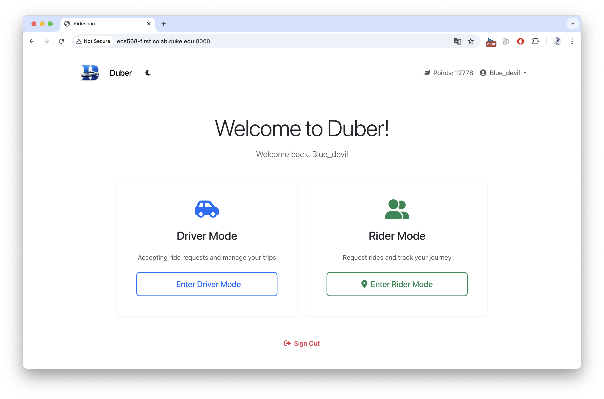

# Duke Duber

**Sustainable Ride Sharing for the Duke Community**

Duke Duber is a ride-sharing web application built with Django, allowing Duke community members to request, share, or offer rides while contributing to a greener campus. Every shared ride reduces CO2 emissions, eases traffic congestion, and earns **Green Coins (Chlorophyll)** toward reforestation in Duke Forest.



## Features

- **Driver & Rider Roles** — Register as a driver to offer rides, or as a rider to request or share one.
- **Ride Sharing** — Riders can search for and join existing rides headed in their direction.
- **Route Optimization** — Google Maps Directions API optimizes shared-ride pickup/drop-off order.
- **Green Coins (Chlorophyll)** — Earn points based on miles traveled; redeem for succulents, seeds, or produce from Duke campus.
- **Email Notifications** — Riders receive an email confirmation when a driver accepts their ride.
- **Dark Mode** — System-aware dark/light theme toggle.

## Tech Stack

- **Backend**: Django 5.1, PostgreSQL
- **Frontend**: Bootstrap 5, SweetAlert2
- **APIs**: Google Maps Distance Matrix & Directions API, Gmail API
- **Infrastructure**: Docker, Docker Compose, Nginx

## Prerequisites

- Docker and Docker Compose
- A `.env` file (see below)
- Google Maps API key
- Gmail OAuth2 credentials (`credentials.json` + `token.json`) for email notifications

## Setup

### 1. Clone the repository

```bash
git clone <repo-url>
cd duke-duber
```

### 2. Create a `.env` file

Create `docker-deploy/duber-web-app/.env` with the following variables:

```env
DJANGO_SECRET_KEY=your-secret-key-here
DJANGO_DEBUG=False

POSTGRES_DB=postgres
POSTGRES_USER=postgres
POSTGRES_PASSWORD=your-db-password

GOOGLE_MAPS_API_KEY=your-google-maps-api-key

EMAIL_HOST_USER=your-gmail@gmail.com
EMAIL_HOST_PASSWORD=your-app-password
```

> For email to work, generate an [App Password](https://support.google.com/accounts/answer/185833) from your Google account, or set up OAuth2 credentials.

### 3. (Optional) Set up Gmail OAuth2

If using the Gmail API for email notifications:
1. Download `credentials.json` from Google Cloud Console (OAuth2 client)
2. Place it in `docker-deploy/duber-web-app/`
3. Run `python gmail_token.py` once locally to generate `token.json`
4. Copy `token.json` into the same directory

### 4. Start the application

```bash
cd docker-deploy
docker-compose up --build
```

The app will be available at [http://localhost:8000](http://localhost:8000).

### 5. Stopping the application

```bash
docker-compose down
```

To also remove the database volume:

```bash
docker-compose down -v
```

## Project Structure

```
docker-deploy/
  duber-web-app/
    accounts/       # User registration, login, profile
    rider/          # Ride requests, sharing, dashboard
    driver/         # Driver registration, ride acceptance
    points/         # Green Coins system, redemption
    utils/          # Gmail API helper
    duke_duber/     # Django project settings and URLs
    templates/      # Base HTML templates
    static/         # Static assets (CSS, images)
  nginx/            # Nginx reverse proxy config
  docker-compose.yml
```

## Green Coins System

| Action | Reward |
|--------|--------|
| Complete a ride (driver) | Distance × 1000 pts |
| Complete a ride (rider) | Distance × 1000 pts |
| Complete a shared ride (sharer) | Segment distance × 1000 pts |

**Redemption options:**
- 300 pts — Succulent (Duke Garden)
- 500 pts — Vegetables & fruits (Duke Farm)
- 1000 pts — Tree seed (Duke Forest)

## Environment Variables Reference

| Variable | Description | Default |
|----------|-------------|---------|
| `DJANGO_SECRET_KEY` | Django secret key | insecure dev key |
| `DJANGO_DEBUG` | Enable debug mode | `True` |
| `POSTGRES_DB` | Database name | `postgres` |
| `POSTGRES_USER` | Database user | `postgres` |
| `POSTGRES_PASSWORD` | Database password | `postgres` |
| `GOOGLE_MAPS_API_KEY` | Google Maps API key | — |
| `EMAIL_HOST_USER` | Gmail address | — |
| `EMAIL_HOST_PASSWORD` | Gmail app password | — |
